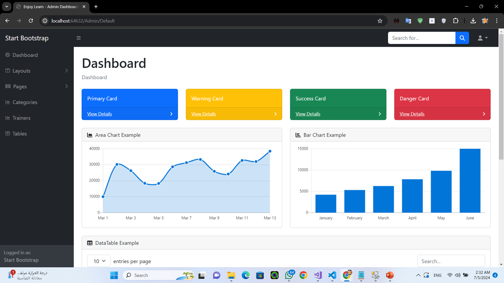

welcome in my project Enjoy learn
Intro to Application:-
It is a program for online learning and courses that you can join and learn about all the available courses through the website. It consists of a user interface through which you can subscribe to the available courses. 
And an interface for the user, which provides full control over the website, such as adding trainers, courses, etc....
priject gethub link:- https://github.com/MGHefny/EnjoyLearn.git
team work :- https://www.linkedin.com/in/mohamed-hefny-83418019b/
Installation:- need sql server and dev app like (vs code or vs)
Usage :- using in this project c#, .net MVC , sql server
